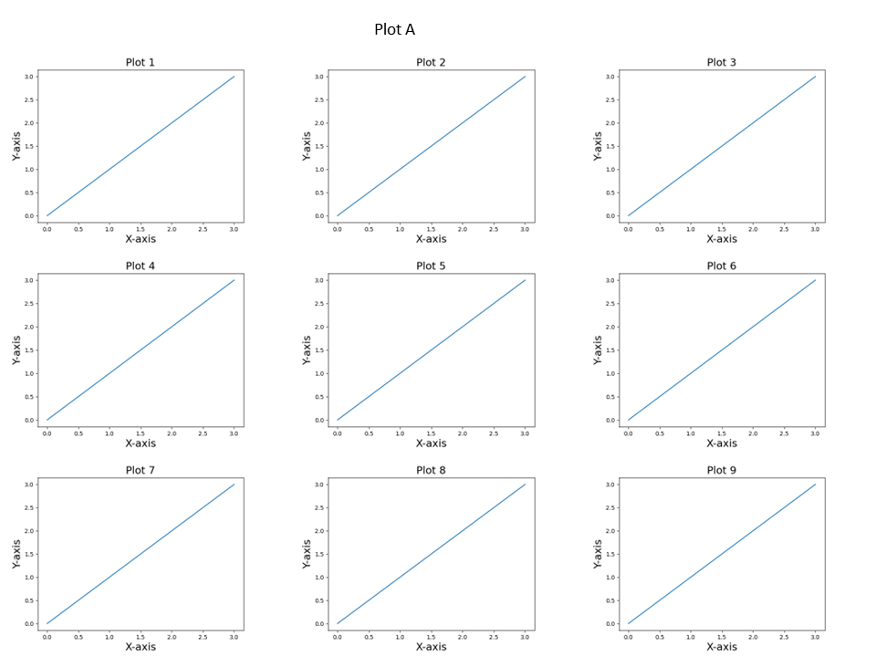
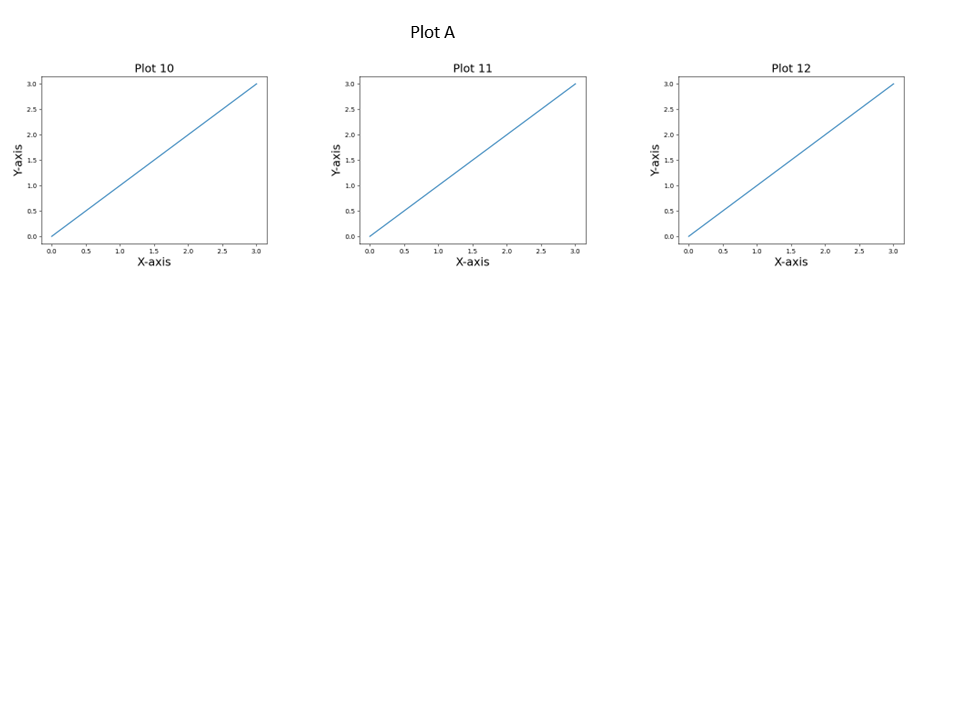

# PPT Image Inserter

This project provides a utility to insert images into a PowerPoint presentation in a grid layout, maintaining the aspect ratio of images.

## Features
- Automatically arrange images in a specified grid layout.
- Maintain aspect ratio of images.
- Automatically add new slides when the grid is full.
- Customizable title font size and image spacing.

## Installation

1. Clone the repository:
   ```sh
   git clone https://github.com/rkim48/ppt-image-inserter.git
   cd ppt-image-inserter
2. Install the required libraries:
   ```sh
   pip install -r requirements.txt
3. Run the example script to generate sample PowerPoint presentations:
   ```sh
   python example.py

Example slides:

 


